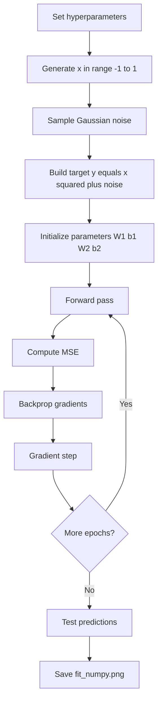
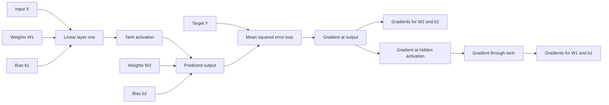
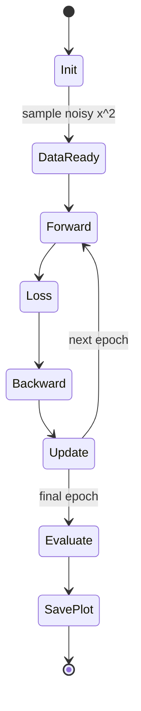
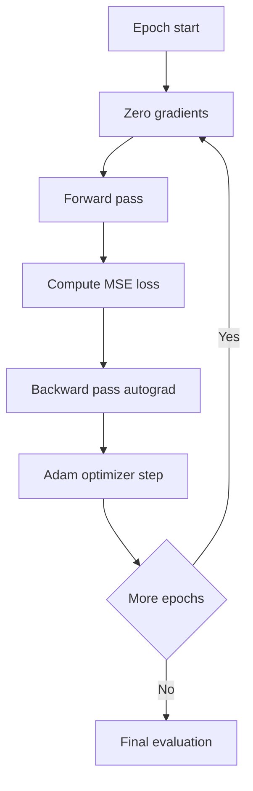

# Mathematical Write-Up: Fitting a Noisy x^2 with a 1-Hidden-Layer Neural Net

## 1. Problem Setup

The training data in train.py is generated on [-1, 1] with additive Gaussian noise:

$$
x_i \sim \text{linspace}(-1,1,n), \qquad
\epsilon_i \sim \mathcal{N}(0,\sigma^2), \qquad
y_i = x_i^2 + \epsilon_i
$$

where:

- n = NUM_OBS
- sigma = NOISE_STD

So the network learns a noisy version of the target function f(x)=x^2.

## 2. Model Architecture

The model is a fully connected network with one hidden tanh layer:

$$
z_1 = XW_1 + b_1, \quad
a_1 = \tanh(z_1), \quad
\hat{Y} = a_1W_2 + b_2
$$

Shapes in the implementation:

- X in R^{n x 1}
- W1 in R^{1 x h}, b1 in R^{1 x h}, h=16
- W2 in R^{h x 1}, b2 in R^{1 x 1}
- Y-hat, Y in R^{n x 1}

## 3. Objective

Mean squared error:

$$
\mathcal{L} = \frac{1}{n}\sum_{i=1}^{n}(\hat{y}_i - y_i)^2
= \frac{1}{n}\|\hat{Y}-Y\|_2^2
$$

## 4. Backpropagation Equations

Starting derivative:

$$
\frac{\partial \mathcal{L}}{\partial \hat{Y}} = \frac{2}{n}(\hat{Y}-Y)
$$

Output layer:

$$
\frac{\partial \mathcal{L}}{\partial W_2} = a_1^T\frac{\partial \mathcal{L}}{\partial \hat{Y}}, \qquad
\frac{\partial \mathcal{L}}{\partial b_2} = \sum_{i=1}^{n} \frac{\partial \mathcal{L}}{\partial \hat{Y}_i}
$$

Hidden layer chain rule:

$$
\frac{\partial \mathcal{L}}{\partial a_1}
= \frac{\partial \mathcal{L}}{\partial \hat{Y}}W_2^T
$$

Using tanh derivative:

$$
\frac{\partial \mathcal{L}}{\partial z_1}
= \frac{\partial \mathcal{L}}{\partial a_1} \odot (1-\tanh^2(z_1))
$$

Input layer gradients:

$$
\frac{\partial \mathcal{L}}{\partial W_1} = X^T\frac{\partial \mathcal{L}}{\partial z_1}, \qquad
\frac{\partial \mathcal{L}}{\partial b_1} = \sum_{i=1}^{n}\frac{\partial \mathcal{L}}{\partial z_{1,i}}
$$

## 5. Update Rule

For learning rate eta:

$$
W_1 \leftarrow W_1 - \eta\frac{\partial \mathcal{L}}{\partial W_1}, \quad
b_1 \leftarrow b_1 - \eta\frac{\partial \mathcal{L}}{\partial b_1}
$$

$$
W_2 \leftarrow W_2 - \eta\frac{\partial \mathcal{L}}{\partial W_2}, \quad
b_2 \leftarrow b_2 - \eta\frac{\partial \mathcal{L}}{\partial b_2}
$$

The script repeats this for 5000 epochs.

## 6. Why This Works

- A 1-hidden-layer tanh net is expressive enough to approximate smooth 1D functions.
- x^2 is smooth and low complexity.
- Noise in targets makes the model fit a smoothed trend rather than exact interpolation.
- MSE is natural for Gaussian-like noise.

## 7. Funky Mermaid Diagrams

### A. Training Pipeline

### B. Computation Graph and Gradient Flow

### C. Training Lifecycle

## 8. train_torch.py Details

The PyTorch version follows the same regression objective but delegates gradient bookkeeping to autograd.

### 8.1 Data and Targets

The script builds:

$$
X = \text{linspace}(-1,1,n), \quad
\epsilon \sim \mathcal{N}(0,\sigma^2), \quad
Y = X^2 + \epsilon
$$

where n is NUM_OBS and sigma is NOISE_STD.

### 8.2 Model

In train_torch.py the model is:

$$
\hat{Y} = W_2\tanh(W_1X + b_1) + b_2
$$

with hidden width 32 (Linear(1, 32) -> Tanh -> Linear(32, 1)).

### 8.3 Loss and Optimization

Loss:

$$
\mathcal{L}_{\text{MSE}} = \frac{1}{n}\sum_{i=1}^{n}(\hat{y}_i - y_i)^2
$$

Optimizer:

- Adam
- learning rate = 0.02
- epochs = 3000

At each epoch, train_torch.py does:

1. optimizer.zero_grad()
2. y_hat = model(x)
3. loss = MSE(y_hat, y)
4. loss.backward()
5. optimizer.step()

### 8.4 Why PyTorch Converges Fast Here

- Automatic differentiation gives exact gradients for this graph.
- Adam adapts per-parameter step sizes, usually stabilizing early optimization.
- The target function x^2 is smooth and low dimensional.

### D. train_torch Pipeline Diagram

### E. train_torch Training Sequence

